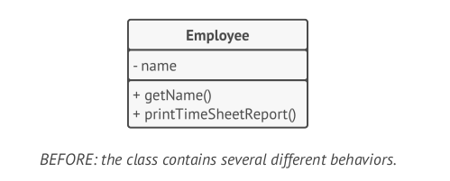
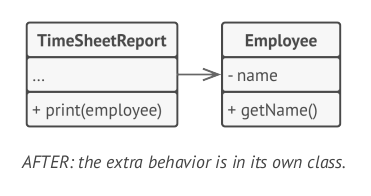
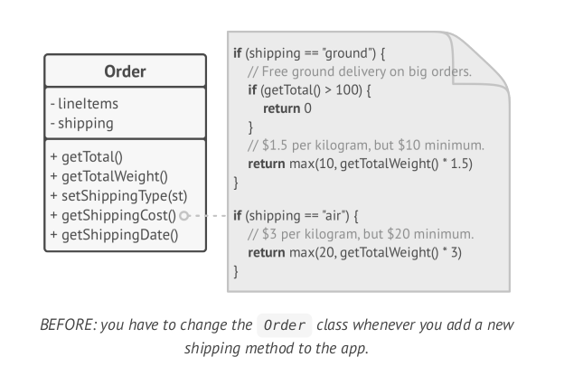
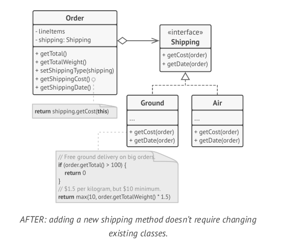
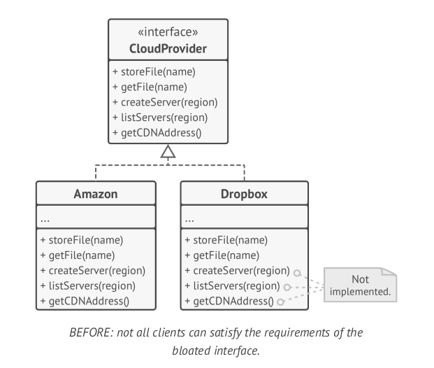
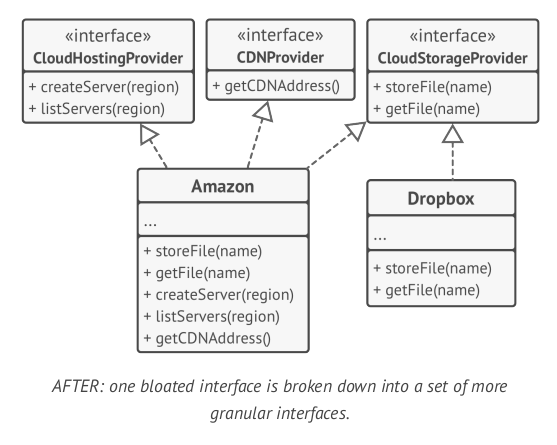
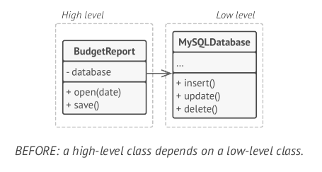
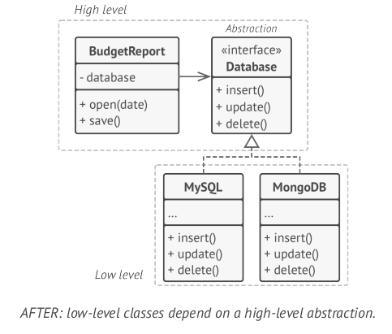

# SOLID Principles

* Single Responsibility Principle
* Open/Closed Principle
* Liskov Substitution Principle
* Interface Segregation Principle
* Dependency Inversion Principle

## Single Responsibility Principle

> A class should have just one reason to change

Try to make every class responsible for a single part of the functionality proviede by the software and make that responsibility entirely encapsulated by the class

Example:

## Open/Closed Principle

> Classes should be open for extension but closed for modification

A class is *open* if you can extend it, produce a subclass and do whatever you want with it.

A class is *closed* if it's 100% ready to be used by other classes; its interface is clearly defined and won't be changed in the future.

## Liskov Substitution Principle

This principle is named by Barbara Liskov, who defined it in 1987 in her work Data abstraction and hierarchy.

> When extending a class, remember that you should be able to pass objects of the subclass in place of objects of the parent class without breaking the client code

In simple terms, the subclass should remain compatible with the behavior of the superclass. When overriding a method, extend the base behavior rather than replacing it with something else entirely.

Here is a set of checks that help predict whether a subclass remains compatible with the code that was able to work with objects of the superclass.

* Parameter types in a method of a subclass should match or be more abstract than parameter types in the method of the super-class.
* The return type in a method of a subclass should match or be a subtype of the return type in the method of the superclass.
* A method in a subclass shouldn't throw types f exceptions which the base method isn't expected to throw.
* A subclass shouldn't strengthen pre-conditions.
* A subclass shouldn't weaken post-conditions.
* Invariants of a superclass must be preserved.
* A subclass shouldn't change values of private fields of the superclass.

## Interface Segregation Principle

> Clients shouldn't be forced to depend on methods they do not use.

Try to make your interfaces narrow enough that client classes don't have to implement behaviors they don't need.

You should break down "fat" interfaces into more granular and specific ones. Clients should implement only those methods that they really need. Otherwise, a change to a "fat" interface would break even clients that don't use the changed methods.

## Dependency Inversion Principle

> High-level classes shouldn't depend on low-level classes. Both should depend on abstractions. Abstractions shouldn't depend on details. Details should depend on abstractions.

* **Low-level classes**: implement basic operations such as working with a disk, transferring data over a network, connecting to a database, etc.
* **High-level classes**: contain complex business logic that directs low-level classes to do something

Sometimes, people design low-level classes first and only then start working on high-level ones. This is very common when you start developing a prototype on a new system, and you’re not even sure what’s possible at the higher level because low-level stuff isn’t yet implemented or clear. With such an approach business logic classes tend to become dependent on primitive low-level classes.

The dependency inversion principle suggests chaning the direction of this dependency.

