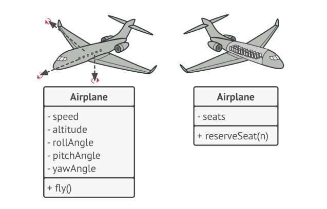
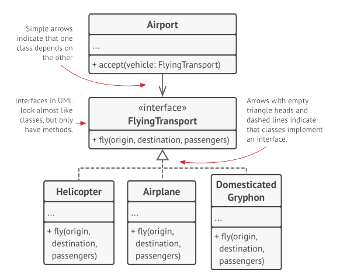
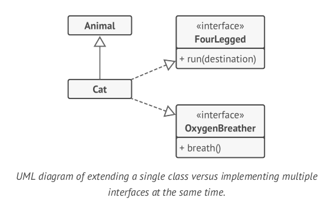
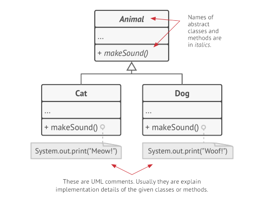

# OOP Concepts

OOP is based on four pillars, concepts that differentiate it from other programming paradigms.

## Abstraction

It is a model of a real-world object or phenomenon, limited to a specific context, which represents all details relevant to this context with high accuracy and omits all the rest.

## Encapsulation

It is the ability of an object to hide parts of its state and behaviors from other objects, exposing only a limited interface to the rest of the program.

To encapsulate something means to make it `private`, and thus accesible only from within of the methods of its own class. There is a mode called `protected` that makes a member of a class available to subclasses as well.

## Inheritance

It is the ability to build new classes on top of existing ones. The main benefit of inheritance is code reuse.

* Subclasses have the same interface as their parent class.
* You cannot hide a method in a subclass if it was declared in the superclass.
* You must also implement al abstract methods, even if they don't make sen for your subclass

## Polymorphism

It is the ability of a program to detect the real class of an object and call its implementation even when its real type is unknown in the current context.

